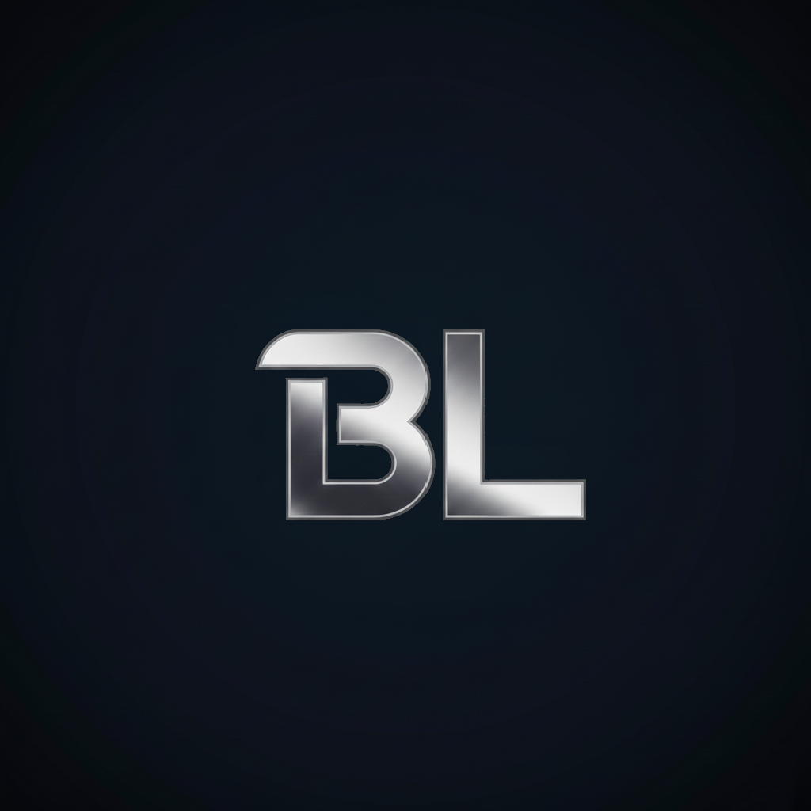
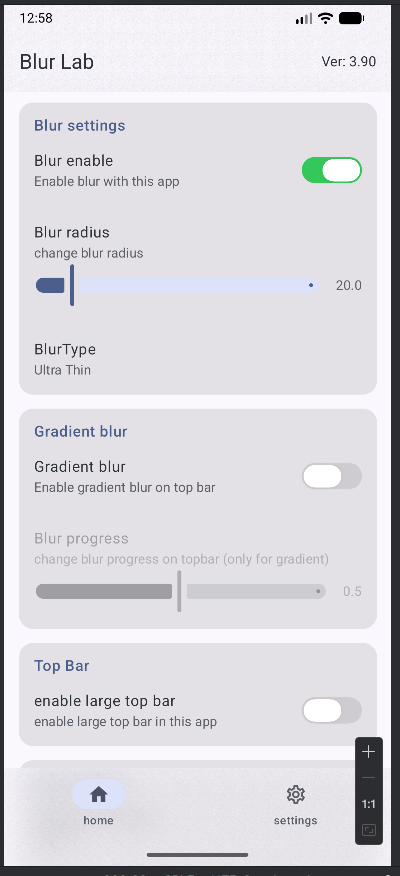
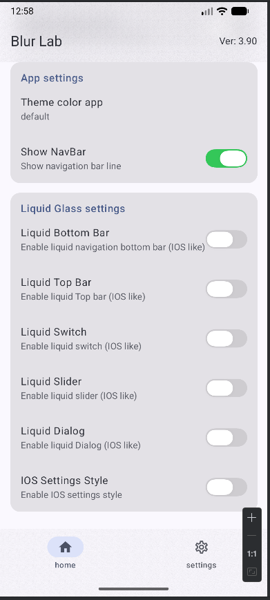

# **Blur Lab**

### **Blur Lab** — приложение для тонкой настройки эффектов размытия в интерфейсе Android.
Позволяет управлять blur-эффектами, градиентным блюром и визуальными элементами UI в реальном времени.

 |  | 

✨ **Возможности**

•  Включение / отключение Gaussian Blur  
•  Gradient Blur (градиентное размытие) 
•   Управление совместимостью с Liquid / Glass UI 
•  Поддержка светлой и тёмной темы 
•  Динамические темы (Android 12+) 
•  Мгновенное применение настроек 
•  Минималистичный Material-интерфейс 

⚙️ **Настройки блюра** 

•  Blur Enable — основной переключатель размытия 
•  Gradient Blur — градиентный эффект поверх блюра 
•  Liquid Top Bar — стеклянная / жидкая панель (имеет приоритет над блюром) 
•  Если включён Liquid Top Bar, blur-эффекты автоматически отключаются во избежание конфликтов. 

🌓 **Темы** 

•  Default (следует системной) 
•  Light / Dark 
•  Dynamic Light / Dynamic Dark 
•  Цветовые акценты (Red, Yellow и др.) 

🛠 **Технически** 

•  Jetpack Compose 
•  Material 3 
•  Поддержка Android 12+ 
•  Оптимизировано для производительности 

📦 **Назначение** 

•  Blur Lab предназначен для: 
•  кастомизации UI 
•  тестирования blur-эффектов 
•  визуальных экспериментов 

⚠️ **Примечание** 

Некоторые эффекты могут зависеть от: 

•  версии Android 
•  устройства 
•  графического драйвера 
•  системных ограничений 

🧪 **Статус** 

Проект находится в активной разработке. 
Функции и поведение могут меняться. 

By Android_xDev (telegram)

[Kyant0 AndroidLiquidGlass](https://github.com/Kyant0/AndroidLiquidGlass?ysclid=mjh5n0cdtc366823349)  
[zhanghai ComposePreference](https://github.com/zhanghai/ComposePreference?ysclid=mjh5odgb8b537839430)  
[chrisbanes haze](https://github.com/chrisbanes/haze?ysclid=mjh5oylsfl815848546)  
